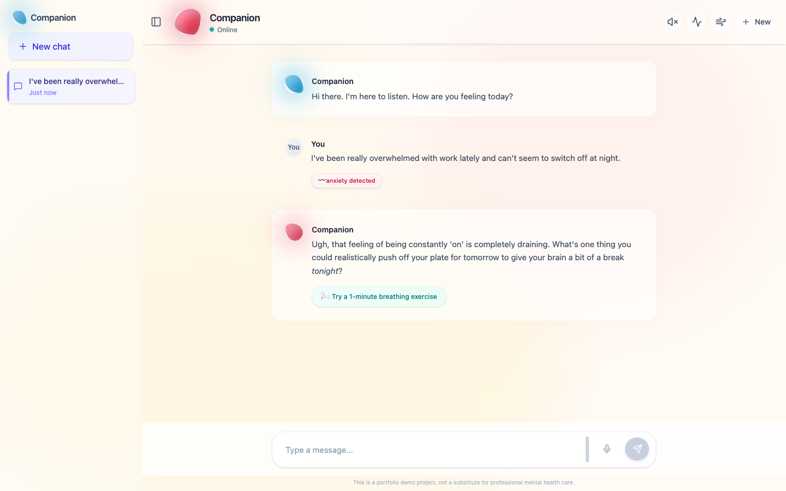
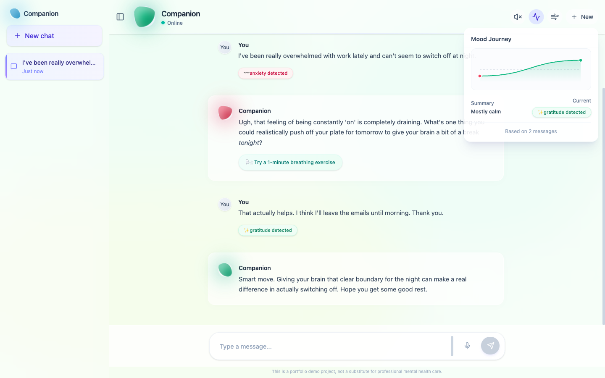

# Companion — An AI Wellness Chat that Feels the Room


> A ChatGPT/Claude-style wellness companion that **reads the emotion behind each message** and responds like a warm, grounded friend — not a therapist reading from a script. Replies stream token-by-token, the whole interface quietly shifts color with your mood, and it can speak back in a natural Google voice.

**🔗 [Live demo](https://mental-health-chatbot-phi-one.vercel.app/)** &nbsp;·&nbsp; Frontend + serverless API on Vercel · Gemini 2.5 Flash via Google Cloud Vertex AI

Most chatbot demos are a text box and a spinner. This one is built around a simple idea: **how you feel should change how the app feels.** Every message is scored for emotion; that emotion tints the background, animates the mood orb, plots a live mood graph, and steers the model's tone — while a crisis-language check can switch the app into a dedicated support mode.



## Screenshots

**Emotion-aware conversation** — the app tags each message ("anxiety detected"), warms the whole canvas to match, and offers a one-tap breathing exercise when it senses you're anxious:


**Mood Journey** — sentiment is tracked across the conversation and drawn as a live valence graph; here the mood climbs from anxiety back up to gratitude and the atmosphere follows it green:



## Features

| Feature | What it does |
|---|---|
| **Streaming replies** | Responses stream in token-by-token over SSE (Gemini `streamGenerateContent`), with **Stop** to interrupt mid-reply. |
| **Emotion-aware atmosphere** | A lightweight sentiment pass classifies each message (joy / sadness / anxiety / anger / gratitude / neutral); the background gradient, motion and mood orb react in real time. |
| **Mood Journey** | A running valence graph of the conversation with a plain-language summary ("Mostly calm"). |
| **Conversation history** | Multi-conversation sidebar with auto-titling, persisted in `localStorage` — start a new chat, switch between them, delete. |
| **Voice mode** | Speak your message (Web Speech STT) and have replies read aloud in a **natural Google Cloud TTS voice** (Chirp3-HD), with a graceful browser-speech fallback. |
| **Breathing exercise** | A guided, animated breathing overlay — offered automatically when anxiety is detected. |
| **Crisis support mode** | Crisis language trips a dedicated support card instead of a normal model reply. |
| **Polished chat UX** | Full-width ChatGPT/Claude-style message rows, Markdown rendering, copy & regenerate, auto-growing composer, starter prompts. |

## How it works

```
   you type ─► sentiment analysis ─► emotion ─┬─► tints atmosphere / orb / mood graph
                                              │
                                              └─► /api/chat-stream ─► Vertex AI (Gemini 2.5 Flash)
                                                        │                      │
                                                  SSE, token-by-token ◄────────┘
                                                        │
                                                  render + (optional) /api/tts ─► natural voice
```

1. Each message runs through a fast local sentiment pass (`sentiment.ts`) that yields an emotion **and** a crisis flag.
2. The emotion is injected into the system prompt so the model *meets you where you are*, and simultaneously drives the UI atmosphere.
3. The conversation (last ~20 turns) is streamed to a Vercel serverless function that calls **Gemini 2.5 Flash on Vertex AI** and relays tokens back over Server-Sent Events.
4. If streaming fails, it falls back to a non-streaming call, and finally to a set of local canned responses — the UI never dead-ends.
5. Optionally, each reply is sent to `/api/tts` (Google Cloud Text-to-Speech, Chirp3-HD voice) and played as MP3; if that's unavailable it falls back to the browser's speech synthesis.

### About the persona
The system prompt is the heart of the project (`api/_persona.ts`). It's deliberately **not** a stock therapist: it talks casually, treats the user as a capable equal (no pet names, no "It sounds like…" openers), leads with something *actually useful* rather than just mirroring feelings, doesn't cave when pushed back on, and takes physical distress (racing heart, can't breathe) seriously by offering concrete grounding steps and pointing to real help. It runs on `gemini-2.5-flash`, which is a *thinking* model — so `thinkingConfig.thinkingBudget` is tuned against `maxOutputTokens` to leave room for a complete reply after the hidden reasoning.

## Tech stack

**Frontend** — React 19 + TypeScript · Vite · Tailwind CSS v4 · Framer Motion · lucide-react · react-markdown + remark-gfm · [`sentiment`](https://www.npmjs.com/package/sentiment) for emotion scoring · Web Speech API (STT)
**Backend** — Vercel serverless functions (`api/*.ts`) · Google Cloud **Vertex AI** — Gemini 2.5 Flash (chat) · Google Cloud **Text-to-Speech** — Chirp3-HD (voice) · `google-auth-library` (service-account auth)

## API

| Method | Endpoint | Description |
|--------|----------|-------------|
| `POST` | `/api/chat-stream` | Stream a reply token-by-token (SSE) for a conversation + detected emotion |
| `POST` | `/api/chat` | Same, non-streaming — used as a fallback |
| `POST` | `/api/tts` | Synthesize a reply to natural-voice MP3 (base64) via Google Cloud TTS |

## Running locally

```bash
npm install
npm run dev
```
The Vite frontend runs at `http://localhost:5173`. The chat/voice backend lives in `api/` and runs on Vercel's serverless runtime — use `vercel dev` (or deploy) to exercise the API routes locally.

### Environment variables
The serverless functions authenticate to Google Cloud with a service-account key. See [`.env.example`](.env.example). You'll need:

| Variable | Purpose |
|----------|---------|
| `GCP_SA_KEY` | Service-account JSON (as a string) with Vertex AI + Cloud TTS access |
| `GCP_PROJECT` | GCP project id (defaults to the demo project) |
| `GCP_LOCATION` | Vertex region, e.g. `us-central1` |
| `GEMINI_MODEL` | Model id, defaults to `gemini-2.5-flash` |

Without credentials the app still runs — it degrades gracefully to its built-in local responses and the browser's speech synthesis.

## Project layout
```
api/
  _persona.ts          Shared GCP auth + the system prompt / persona
  chat-stream.ts       SSE streaming chat endpoint (Vertex AI)
  chat.ts              Non-streaming fallback endpoint
  tts.ts               Google Cloud Text-to-Speech endpoint
src/
  App.tsx              Chat orchestration — streaming, history, voice, crisis flow
  lib/
    sentiment.ts       Local emotion + crisis detection
    emotion.ts         Emotion type + palettes
    chatApi.ts         Streaming / fallback client
    conversationStore.ts  localStorage multi-conversation persistence
  components/
    ChatWindow.tsx · ChatInput.tsx · MessageBubble.tsx
    ConversationSidebar.tsx    History sidebar
    EmotionalAtmosphere.tsx    Mood-reactive background (signature feature)
    MoodJourney.tsx · MoodOrb.tsx · EmotionChip.tsx
    BreathingExercise.tsx · CrisisSupportCard.tsx
  hooks/useVoice.ts    Speech-to-text + text-to-speech (Cloud TTS + fallback)
```

## Roadmap
- Server-side conversation persistence (currently local only)
- Configurable voice / persona presets
- Optional on-device sentiment model for richer emotion classes

---
*Built by [K Jayarama Das](https://github.com/jayaram-07). A portfolio demo — not a substitute for professional mental-health care.*
